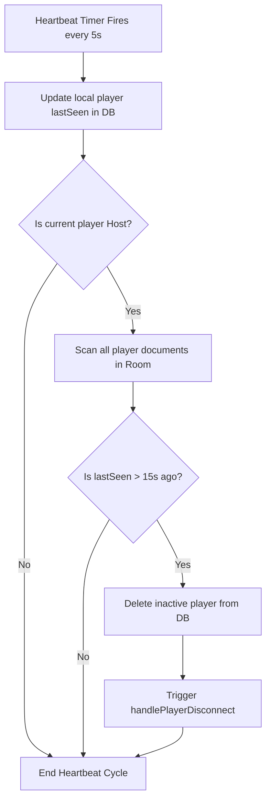

# Database Structure & Security Rules

This document outlines the Firestore structure, security policies, and client-side heartbeat manager.

## 1. Document Hierarchies

Firestore is structured into two primary levels:
* `/rooms/{roomCode}`: Stores the root `GameState` document.
* `/rooms/{roomCode}/players/{playerId}`: Stores individual `PlayerState` documents.

---

## 2. Security Rules (`firestore.rules`)

To protect room data and prevent malicious clients from mutating other players' documents or scores, access control is enforced via Firebase Auth and document properties:

### Policies
* **General Read Access**: Rooms and players can be read by any client (`allow read: if true`).
* **Room Modifications**: Creating, updating, or deleting a room document is restricted to authenticated users who are marked as the room's host (`isRoomHost(roomCode)`).
* **Player Document Ownership**: A player can only write/create their own document if their authenticated user ID matches the player ID (`request.auth.uid == playerId`).
* **Host Overrides**: The host is permitted to update or delete player documents to facilitate mid-game disconnect handling and role redistribution.

### Rules File
* File: `firestore.rules` (located in the workspace root).

---

## 3. Heartbeat & Host Transfer

To keep player lists clean and prevent games from freezing if a player disconnects, `GameService` runs a heartbeat cycle:

### Flow

### Host Transfer Logic
If the host player is deleted or disconnects:
1. The stream listener on remaining active players detects the absence of a host (`!players.any((p) => p.isHost)`).
2. The remaining player who has been in the room the longest (the first document in the Firestore player list) is automatically designated as the new host.
3. The new host writes `isHost: true` to their player document in Firestore and assumes responsibility for evaluating readiness and forcing advancements.
