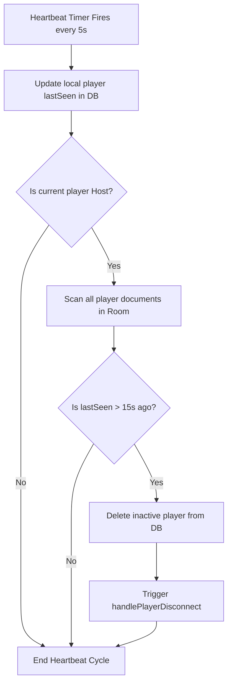

# Database Structure & Security Rules

This document outlines the Firestore structure, security policies, and client-side heartbeat manager.

## 1. Document Hierarchies

Firestore is structured into two primary levels:
* `/rooms/{roomCode}`: Stores the root `GameState` document.
* `/rooms/{roomCode}/players/{playerId}`: Stores individual `PlayerState` documents.

---

## 2. Security Rules (`firestore.rules`)

To protect room data and prevent malicious clients from mutating other players' documents or scores, access control is enforced via Firebase Auth and document properties:

### Policies
* **General Read Access**: Rooms and players can be read by any client (`allow read: if true`).
* **Room Modifications**: Creating, updating, or deleting a room document is restricted to authenticated users who are marked as the room's host (`isRoomHost(roomCode)`).
* **Player Document Ownership**: A player can only write/create their own document if their authenticated user ID matches the player ID (`request.auth.uid == playerId`).
* **Host Overrides**: The host is permitted to update or delete player documents to facilitate mid-game disconnect handling and role redistribution.

### Rules File
* File: `firestore.rules` (located in the workspace root).

---

## 3. Heartbeat & Host Transfer

To keep player lists clean and prevent games from freezing if a player disconnects, `GameService` runs a heartbeat cycle:

### Flow

### Host Transfer Logic
If the host player is deleted or disconnects:
1. The stream listener on remaining active players detects the absence of a host (`!players.any((p) => p.isHost)`).
2. The remaining player who has been in the room the longest (the first document in the Firestore player list) is automatically designated as the new host.
3. The new host writes `isHost: true` to their player document in Firestore and assumes responsibility for evaluating readiness and forcing advancements.

---

## 4. ❓ Open Clarification: Who Is Allowed to Write the Room Document?

**Question**: The security model and the client data-flow currently contradict each other. `firestore.rules` restricts room-document `update`/`delete` to the host (`isRoomHost`, line 34), but **every** player's client writes gameplay state directly into the room document — forgeries/truths/votes into `cards` and readiness into `readyPlayers` (`GameService.submitCardAnswer`/`castVote`/`setPlayerReady`). Which is canonical: **(a)** the room document is host-authoritative and non-hosts must submit via their own player docs for the host to merge, or **(b)** any authenticated room member may write the room document and the rules should be loosened?

**Impact**: This is the deciding factor for the top-priority blocker (**Issue 1** in `ongoing_general_errors.md`): under the current rules, non-host humans get `PERMISSION_DENIED` on every submit/vote/ready, so real multiplayer is non-functional. The answer determines whether we refactor the client (option a) or the rules (option b) — and how much anti-cheat we retain.

**Solutions**:
- **Option A (recommended)**: **Host-authoritative** — non-hosts write only their own player document; the host merges submissions into the room document. Preserves the secure host-only room rule and matches the existing host-driven phase/scoring/disconnect model.
- **Option B**: **Server relay** — a Cloud Function performs room writes with admin rights; clients never write the room directly. Strongest integrity, but adds backend infrastructure that the README currently avoids.
- **Option C**: **Loosen the rule** — allow any authenticated room member to update the room document. Unblocks immediately but lets any client overwrite scores/phase/other players' answers (trivially cheatable).

**Recommended**: Option A — keeps the current trust model and requires no backend, at the cost of a client-side submission refactor.

Your selection: Proceed with Option A. I don't understand this system design but the goal of this app is to be an Apple app store game app that is scalable to a lot of people. Go with the option or create a new option that is the industry standard for security using Firebase.
